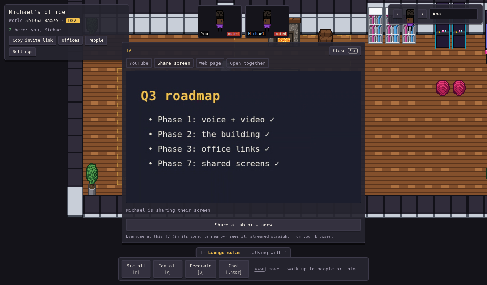
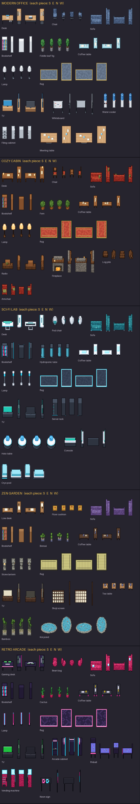
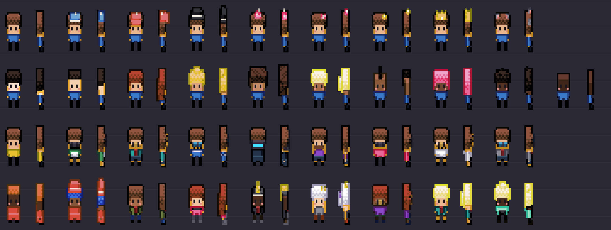
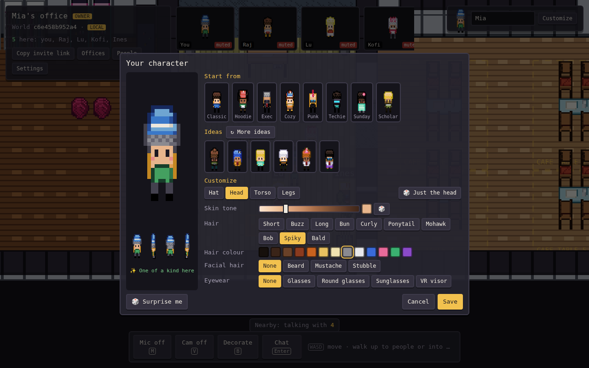

# Pixel Office

A peer-to-peer, pixel-art virtual office in the spirit of Gather. People walk around a
3/4-view world, chat, and decorate rooms together. There is **no game server**: peers find
each other through public Nostr relays and then talk directly over WebRTC.



Built so far:

- **Phase 0**: one room, movement, presence, chat, and multiplayer decorating with 64
  furniture pieces across 5 themes, each in 4 facings.
- **Phase 1**: voice and video. Walk into a **call zone** and you're in a call with everyone
  inside it; walk out and you leave. Outside zones, a **proximity bubble** connects you to
  anyone within about 5 tiles, with volume fading by distance. The world owner draws zones
  (around a couch, a meeting table, a stage) with the zone tool.
- **Phase 2**: the building. Every world is an office building (4 large + 4 small office
  slots, lounge, lobby with elevator, cafe with table zones, library) with as many floors as
  the owner adds. Identities are Ed25519 keys; ownership, moderators, bans and every edit are
  **signed operations** that each peer verifies, so no server decides who's in charge.
- **Phase 3**: offices by link. Claim an empty office or open someone's **office link**: the
  link carries their whole signed office (furniture, floor style, call zones), and it drops
  into a free slot of the right size. Only the office's owner can decorate or zone inside it,
  and every edit is re-signed, so an office can't be tampered with, even in someone else's
  world. World owners choose whether new offices are open, need approval, or are closed.
- **Phase 4**: objects and your own art. Every theme now has a **Portal** (step on it to
  travel to a lobby, an office door or another portal), a **Note board** (shared sticky notes),
  plus the **Whiteboard** (shared drawing) and **TV** (a synced YouTube watch party). Walk up
  and press **E**. The **Custom** palette tab imports your own PNG sprites (1 frame, or 4
  frames S/E/N/W, e.g. straight from Aseprite) into your office or, for mods, the world.
- **Phase 5**: office code. Office owners attach JavaScript to their office (Offices > Office
  code). It runs in each visitor's browser, only after they agree, inside a sandbox: an
  opaque-origin iframe hosting a Web Worker, with a CSP that blocks the network. It uses a
  small `room` SDK: shared state, events, host election, sprites, toasts and HTML panels.
  Samples include a visitor counter, tic-tac-toe and a confetti party.
- **Phase 6**: always on, and ready for crowds. An **anchor peer** (a Node script, e.g. on a
  Raspberry Pi) keeps worlds and offices online when nobody's there. Settings > Network adds
  your **own signaling relay**, **TURN** servers and a **relay-only** privacy mode. **Stage
  zones** let presenters be heard across the whole floor while the audience just listens, and
  in calls with more than 6 people your camera only sends while you're talking.
- **Phase 7**: shared screens, all in the browser. Every TV has four shared modes:
  **YouTube** (synced watch party), **Share screen** (a tab or window streamed peer-to-peer to
  everyone at the TV), **Web page** (a synced in-room browser for sites that allow embedding;
  Figma, Google Docs/Slides, Vimeo, Loom and Twitch links are rewritten to their embed forms)
  and **Open together** (for sites that block embedding: everyone nearby gets a one-click banner).

## Run it

**Windows:** double-click `play.cmd`. It installs Node.js if you don't have it, then opens
the game at <http://localhost:5173>. Open the same URL (including the `#w=…` part) in a
second tab and you'll see two players.

**Any OS:**

```sh
npm install
npm run dev          # http://localhost:5173
```

Add `?net=local` to the URL to use the offline, same-browser transport (no network at all).

## Controls

| Key | Action |
| --- | --- |
| WASD / arrows | Walk |
| Enter | Chat (bubble over your head) |
| M / V | Mic / camera on or off |
| B | Toggle decorate mode |
| R / Shift+R | Rotate the item you're placing, or the furniture under the cursor |
| Click | Place, or pick up furniture to move it |
| Right-click / Delete | Remove furniture under the cursor, or cancel placing |
| Esc | Cancel / leave decorate mode |
| **Customize** (top right) or click your face | Character creator: body, hair, outfit, accessories |
| People / Settings (world card) | See who's here; owners make mods and ban; mods add floors; back up your identity key |
| Stand on the elevator pad | Pick a floor |
| E | Use the object you're next to (whiteboard, notes, TV, portal settings) |
| **Offices** (world card) | Claim the empty office you're standing in; rename, restyle, share or remove yours; mods approve/remove |
| Decorate > **Call zones** (owner/mods) | Drag on the floor to draw a zone; rename or delete it in the list, or right-click it |

*Copy invite link* shares the world. The part after `#` holds the world id and a secret
that encrypts signaling, and it never reaches any web server.

## How it works

```
src/
  net/transport.ts    Transport interface (peers + named channels)
  net/trystero.ts     P2P transport: Trystero over Nostr relays, WebRTC data channels
  net/local.ts        BroadcastChannel transport for offline dev and tests
  net/sync.ts         Yjs document sync over any transport + IndexedDB cache
  media/mesh.ts       One RTCPeerConnection per nearby peer, signaled over the transport
  media/proximity.ts  Zone + distance rules: who hears whom, and how loud
  media/devices.ts    Mic/camera capture, speaking detection
  media/audio.ts      Web Audio mixer: per-voice volume and stereo pan
  media/call.ts       Glue: positions + zones -> calls
  ui/tiles.ts         Video / avatar tiles for everyone you're talking to
  ui/creator.ts       Character creator (turning preview, part chips, colour swatches)
  avatars/voxel.ts    Browser port of the voxel renderer (same shading and outlines as the Python one)
  avatars/parts.ts    Avatar parts, colours, recipe encode/decode, the chibi model builder
  avatars/avatars.ts  Recipe -> 12-frame sprite sheet (4 facings x 3 walk frames), cached textures and thumbnails
  world/building.ts   The floor plan: corridors, commons, office slots, elevator
  world/crypto.ts     Ed25519 identity, signing, canonical JSON, key backup
  world/state.ts      Signed op log (Y.Array) replayed into the world view with permissions
  world/starter.ts    Furniture and zones a new world starts with
  rooms/package.ts    Signed office packages, share-link encoding (deflate + base64url), IndexedDB cache
  rooms/rooms.ts      Office placement ops, package sync between peers, owner-only editing
  ui/offices.ts       Offices panel and the "add this office?" prompt
  objects/panels.ts   Portal settings, whiteboard, note board, TV panels (live state in the Yjs doc)
  objects/tv.ts       Watch-party sync: {video, playing, pos, at} + drift correction
  objects/importer.ts Custom sprite import (PNG, 1 or 4 facings, 30 KB max)
  code/host.ts        Sandbox: opaque-origin iframe + Web Worker, CSP, permission checks, watchdog
  code/sdk.ts         The `room` API that office code sees (runs inside the worker)
  code/runner.ts      Runs the code of the office you're in, with consent; wires SDK calls to the game
  code/editor.ts      Owner's code editor (samples, permissions, website list, live log)
  objects/screens.ts  Screen sharing onto TVs (its own media mesh, "at the TV" rules)
  objects/embeds.ts   Rewrites share links to embeddable URLs
anchor/
  anchor.mjs          Always-on peer: keeps world docs + office packages on disk (Node + werift)
  relay.mjs           Optional self-hosted signaling relay (instead of public Nostr relays)
  world/room.ts       Room geometry, footprints, placement rules, starter layout
  scenes/WorldScene.ts  Phaser scene: rendering, depth sorting, movement, decorate mode
  ui/hud.ts           DOM overlay: world card, identity, palette, chat
tools/assets/         Voxel -> pixel-art generator for all furniture, floors, walls, avatars
tests/                Playwright tests (two peers in one browser)
```

- **Presence** (position, facing, walking, avatar, name) is broadcast about 10 times a second
  while you move, with a 1 Hz heartbeat. Remote avatars are smoothed on arrival.
- **Furniture and room style** live in a Yjs CRDT (`decor`, `room` maps). Edits merge on
  every peer; a newcomer receives the full document when they connect, and each visitor
  caches the world in IndexedDB.

**Calls.** Each pair of people who should hear each other gets a direct WebRTC connection
with one audio and one video track. Toggling your mic or camera swaps the track in place, so
nothing renegotiates. The peer with the smaller id always makes the offer (no glare), and
calls connect at 5 tiles and drop at 6.5, so standing on the edge doesn't flicker. Video is
capped at 320×240, 15 fps, ~350 kbps so a 6-person mesh fits a home connection. Calls,
presence and heartbeats run on a timer, not the render loop, so they keep working when
the tab is in the background.

**Signed op log.** All shared state (furniture, zones, roles, bans, policy, floors) is an
append-only Yjs array of operations, each signed by its author's Ed25519 key. Every peer
replays the log in timestamp order and applies an op only if the signature checks out and the
author had the right role at that moment. The world id is `hash(ownerKey + nonce)`, so only
the creator's key can write the genesis op; a forged genesis or a guest's zone edit is simply
ignored by everyone. Peers also sign their session id at connect ("hello"), which binds a
WebRTC peer to an identity so bans apply to presence, chat and calls.

Known limits: a malicious peer can still append junk (ignored, but it grows the log), and a
mod could backdate ops before a demotion. Log compaction and anchor-peer checkpoints are
later work.

**Offices.** An office is a JSON package `{owner, roomId, ver, name, size, floorStyle,
things, zones, objects, code}` signed by its owner. Share links put the whole package
(deflate-compressed, base64url) in the URL fragment, so a link works even when you're offline.
Placing it writes a signed `room.place` op (slot, floor, owner, roomId); the package itself
travels peer to peer and the highest valid `ver` wins. Zones may nest; the smallest one you
stand in is your call. Edits you make in one world reach other worlds your office is in when
you (or anyone carrying the newer version) visit them.

**Objects.** A portal, whiteboard, note board or TV is ordinary furniture whose item name
gives it behaviour; portal destinations are stored as signed config on the piece. The shared
state (strokes, notes, what's playing) lives in the world's Yjs doc keyed by the object's id:
collaborative and unsigned by design, like a real whiteboard. The TV never re-streams video:
everyone's own YouTube player seeks to `pos + (now - at)` whenever it drifts more than 0.8 s.

**Office code sandbox.**

| Layer | What it stops |
| --- | --- |
| `<iframe sandbox="allow-scripts">` (no `allow-same-origin`) | Opaque origin: no access to the page, its storage, cookies or keys |
| Web Worker inside that iframe | Runaway code runs on its own thread; the game never freezes |
| CSP `default-src 'none'; connect-src 'none'` | No network unless the office lists domains and the visitor approves |
| Permission checks on every SDK call | `state`, `events`, `sprites`, `ui`, `players`, `embed`, `network`, shown in the consent prompt |
| Watchdog | Kills code that stops answering pings for 3 s or sends more than 300 messages/s |
| Limits | 64 KB of code, 256 KB of shared state, 64 sprites, panels in their own sandboxed iframe |

```js
// a taste of the SDK
room.on('enter', (p) => room.ui.toast('Hi ' + p.name))
room.on('interact', (thingId) => room.broadcast('ding', { thingId }))
room.on('message', (from, ev, data) => { if (room.isHost()) room.state.set('last', ev) })
```

Consent is stored per office *and* per version of the code (a hash), so a changed program
asks again. Owners' own code always runs for them.

**Stages and crowds.** Each connection now has per-direction send controls. On a stage zone,
presenters send to everyone on the floor who isn't in another zone and hear nothing back; the
audience sends nothing, so a talk costs each listener one connection per presenter. In calls
with more than 6 people, cameras only send for 20 s after you last spoke (audio always flows).
For hundreds of people, a self-hosted SFU such as LiveKit is the next step; it isn't built in.

**Identity.** Your key lives in this browser (`localStorage`). *Settings > Copy key backup*
gives you a text key to restore elsewhere. Add `?profile=name` to the URL to run several
identities in one browser (handy for testing).

## Art pipeline

Every piece is a small voxel model (`tools/assets/models.py`) rendered in oblique 3/4 view
by `tools/assets/voxel.py`, which gives shading, outlines, contour lines and material
textures. Rotating the model about its vertical axis gives the S/E/N/W views, so
footprints rotate correctly (a 2×1 desk becomes 1×2).

```sh
pip install pillow numpy
npm run assets       # rebuilds public/assets/* and preview sheets in tools/assets/preview/
```



Themes: Modern Office, Cozy Cabin, Sci-Fi Lab, Zen Garden, Retro Arcade (`themes.py`
palettes). To add a piece, write a builder in `models.py` and register it in `SHARED` or
`SPECIALS`. Output PNGs open fine in Aseprite for hand touch-ups.

### Characters

A character has four parts, each with its own tab (and its own 🎲) in the creator:

- **Hat**: none, beanie, cap, top hat, party hat, bow, flower, crown or cat ears, in any of 16 colours. Hats are small and sit on top of the hair.
- **Head**: a skin-tone slider that blends smoothly from light to deep, 10 hair styles in 13 colours, facial hair, and eyewear (glasses, round glasses, sunglasses, VR visor).
- **Torso**: T-shirt, hoodie, suit, sweater, dress or tank top, with a colour and a trim colour.
- **Legs**: pants, shorts or skirt, a colour, and shoes.

**Start from** offers 8 starter looks. Picking one usually (80%) gives you your own take on it,
with a new skin tone and fresh colours that still go together, and never an exact copy of
someone in the world. "Use the original" is one click away. **Ideas** shows matching combos
(bright tops get calm bottoms, shoes stay neutral) and the creator tells you if someone here
already looks exactly like you. New visitors start with a random matching combo.

Avatars are built in the browser from a short recipe (`v2.` + 13 numbers). The recipe is what
goes over the network, and every peer renders it with `src/avatars/voxel.ts`, so there are no
image downloads and bad values fall back to safe defaults. Older recipes (`v1.`) and the
original 8 presets still load. To add a part, add a name to its list in `parts.ts` and a
case in `buildHat` / `buildHead` / `buildTorso` / `buildLegs`.




## Test

```sh
npx playwright install chromium
npm test             # 4-person video call with fake cameras, sandbox attacks, and a real
                     # WebRTC run through a local relay + anchor peer
```

## Keep a world online (anchor peer)

Any machine with Node 20+ works; a Raspberry Pi is perfect.

```sh
git clone https://github.com/Mjmc99/pixel-office && cd pixel-office
npm install
# copy the command from Settings > Network in your world, e.g.
npm run anchor -- --invite "#w=abc123def456.SECRET"
```

The anchor joins as a silent peer, saves everything to `./anchor-data`, and hands the world and
office packages to whoever arrives. It never signs anything, so it can't change a world; every
browser still verifies the log and packages itself. Several `--invite` flags anchor several
worlds. To run it as a service, use `pm2 start anchor/anchor.mjs -- --invite …` or a systemd
unit.

An anchor started while people are already in a world can take up to a minute to join them
(peers re-announce every 60 s); anyone arriving later connects to it right away.
Add `--stun off` when the anchor and its visitors share a machine or LAN: it skips public STUN
lookups and starts much faster. Add `--verbose` to log relay and WebRTC connection steps.

**Own relay (optional).** `npm run relay -- --port 8787` starts a signaling relay. Put it
behind TLS (e.g. Caddy) and enter `wss://your-host` in Settings > Network (or add
`?relay=wss://your-host` to a link) for everyone who should use it, and pass
`--relay wss://your-host` to the anchor.

**TURN.** Some networks block direct connections. Add a TURN server in Settings > Network, e.g.
Cloudflare's (1,000 GB/month free) or your own coturn. With **relay-only** on, all traffic goes
through TURN and peers never see your IP.

## Put it online (free)

1. Create a GitHub repo and push this folder to `main`.
2. In the repo: **Settings > Pages > Source: GitHub Actions**.
3. Every push runs the tests and deploys to `https://<you>.github.io/<repo>/`. Send friends
   that URL with your `#w=…` invite.

The game has to be served over HTTPS (or localhost) because browser crypto and WebRTC
require it. That's why friends on other networks need the Pages URL, not your PC's IP.

## Status and known limits

All seven phases of the plan are built and covered by tests (`npm test`). Things worth knowing:

- **Real-world P2P** is tested end to end over a self-hosted relay; over public Nostr relays
  and across home networks it still needs real-world testing, and some networks will need TURN.
- **Scale**: one world is one Trystero room (everyone on all floors shares the signaling
  room). That's fine for tens of people; hundreds would need per-floor rooms and an SFU.
- **Governance log**: never compacted yet; a spammer can grow it (their ops are ignored).
- **Office updates across worlds** travel when someone carrying the newer version visits.
- **Watch party** sync uses each browser's clock (fine when OS clocks are NTP-synced).
- **Sites that block iframes** can't be browsed together in-page; use Share screen or Open
  together for those.
