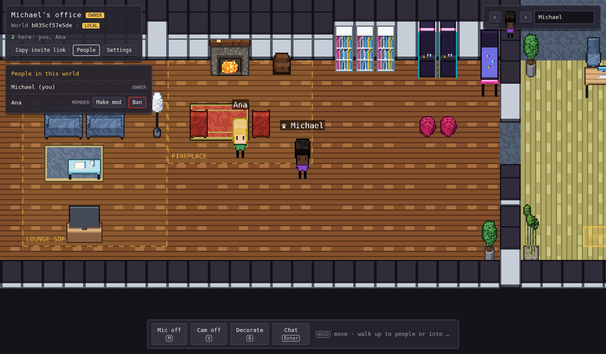

# Pixel Office

A peer-to-peer, pixel-art virtual office in the spirit of Gather. People walk around a
3/4-view world, chat, and decorate rooms together. There is **no game server**: peers find
each other through public Nostr relays and then talk directly over WebRTC.



Built so far:

- **Phase 0**: one room, movement, presence, chat, and multiplayer decorating with 64
  furniture pieces across 5 themes, each in 4 facings.
- **Phase 1**: voice and video. Walk into a **call zone** and you're in a call with everyone
  inside it; walk out and you leave. Outside zones, a **proximity bubble** connects you to
  anyone within about 5 tiles, with volume fading by distance. The world owner draws zones
  (around a couch, a meeting table, a stage) with the zone tool.
- **Phase 2**: the building. Every world is an office building (4 large + 4 small office
  slots, lounge, lobby with elevator, cafe with table zones, library) with as many floors as
  the owner adds. Identities are Ed25519 keys; ownership, moderators, bans and every edit are
  **signed operations** that each peer verifies, so no server decides who's in charge.

## Run it

**Windows:** double-click `play.cmd`. It installs Node.js if you don't have it, then opens
the game at <http://localhost:5173>. Open the same URL (including the `#w=…` part) in a
second tab and you'll see two players.

**Any OS:**

```sh
npm install
npm run dev          # http://localhost:5173
```

Add `?net=local` to the URL to use the offline, same-browser transport (no network at all).

## Controls

| Key | Action |
| --- | --- |
| WASD / arrows | Walk |
| Enter | Chat (bubble over your head) |
| M / V | Mic / camera on or off |
| B | Toggle decorate mode |
| R / Shift+R | Rotate the item you're placing, or the furniture under the cursor |
| Click | Place, or pick up furniture to move it |
| Right-click / Delete | Remove furniture under the cursor, or cancel placing |
| Esc | Cancel / leave decorate mode |
| People / Settings (world card) | See who's here; owners make mods and ban; mods add floors; back up your identity key |
| Stand on the elevator pad | Pick a floor |
| Decorate > **Call zones** (owner/mods) | Drag on the floor to draw a zone; rename or delete it in the list, or right-click it |

*Copy invite link* shares the world. The part after `#` holds the world id and a secret
that encrypts signaling, and it never reaches any web server.

## How it works

```
src/
  net/transport.ts    Transport interface (peers + named channels)
  net/trystero.ts     P2P transport: Trystero over Nostr relays, WebRTC data channels
  net/local.ts        BroadcastChannel transport for offline dev and tests
  net/sync.ts         Yjs document sync over any transport + IndexedDB cache
  media/mesh.ts       One RTCPeerConnection per nearby peer, signaled over the transport
  media/proximity.ts  Zone + distance rules: who hears whom, and how loud
  media/devices.ts    Mic/camera capture, speaking detection
  media/audio.ts      Web Audio mixer: per-voice volume and stereo pan
  media/call.ts       Glue: positions + zones -> calls
  ui/tiles.ts         Video / avatar tiles for everyone you're talking to
  world/building.ts   The floor plan: corridors, commons, office slots, elevator
  world/crypto.ts     Ed25519 identity, signing, canonical JSON, key backup
  world/state.ts      Signed op log (Y.Array) replayed into the world view with permissions
  world/starter.ts    Furniture and zones a new world starts with
  world/room.ts       Room geometry, footprints, placement rules, starter layout
  scenes/WorldScene.ts  Phaser scene: rendering, depth sorting, movement, decorate mode
  ui/hud.ts           DOM overlay: world card, identity, palette, chat
tools/assets/         Voxel -> pixel-art generator for all furniture, floors, walls, avatars
tests/                Playwright tests (two peers in one browser)
```

- **Presence** (position, facing, walking, avatar, name) is broadcast about 10 times a second
  while you move, with a 1 Hz heartbeat. Remote avatars are smoothed on arrival.
- **Furniture and room style** live in a Yjs CRDT (`decor`, `room` maps). Edits merge on
  every peer; a newcomer receives the full document when they connect, and each visitor
  caches the world in IndexedDB.

**Calls.** Each pair of people who should hear each other gets a direct WebRTC connection
with one audio and one video track. Toggling your mic or camera swaps the track in place, so
nothing renegotiates. The peer with the smaller id always makes the offer (no glare), and
calls connect at 5 tiles and drop at 6.5, so standing on the edge doesn't flicker. Video is
capped at 320×240, 15 fps, ~350 kbps so a 6-person mesh fits a home connection. Calls,
presence and heartbeats run on a timer, not the render loop, so they keep working when
the tab is in the background.

**Signed op log.** All shared state (furniture, zones, roles, bans, policy, floors) is an
append-only Yjs array of operations, each signed by its author's Ed25519 key. Every peer
replays the log in timestamp order and applies an op only if the signature checks out and the
author had the right role at that moment. The world id is `hash(ownerKey + nonce)`, so only
the creator's key can write the genesis op; a forged genesis or a guest's zone edit is simply
ignored by everyone. Peers also sign their session id at connect ("hello"), which binds a
WebRTC peer to an identity so bans apply to presence, chat and calls.

Known limits: a malicious peer can still append junk (ignored, but it grows the log), and a
mod could backdate ops before a demotion. Log compaction and anchor-peer checkpoints are
later work.

**Identity.** Your key lives in this browser (`localStorage`). *Settings > Copy key backup*
gives you a text key to restore elsewhere. Add `?profile=name` to the URL to run several
identities in one browser (handy for testing).

## Art pipeline

Every piece is a small voxel model (`tools/assets/models.py`) rendered in oblique 3/4 view
by `tools/assets/voxel.py`, which gives shading, outlines, contour lines and material
textures. Rotating the model about its vertical axis gives the S/E/N/W views, so
footprints rotate correctly (a 2×1 desk becomes 1×2).

```sh
pip install pillow numpy
npm run assets       # rebuilds public/assets/* and preview sheets in tools/assets/preview/
```


Themes: Modern Office, Cozy Cabin, Sci-Fi Lab, Zen Garden, Retro Arcade (`themes.py`
palettes). To add a piece, write a builder in `models.py` and register it in `SHARED` or
`SPECIALS`. Output PNGs open fine in Aseprite for hand touch-ups.

## Test

```sh
npx playwright install chromium
npm test             # includes a 4-person video call with fake cameras
```

## Put it online (free)

1. Create a GitHub repo and push this folder to `main`.
2. In the repo: **Settings > Pages > Source: GitHub Actions**.
3. Every push runs the tests and deploys to `https://<you>.github.io/<repo>/`. Send friends
   that URL with your `#w=…` invite.

The game has to be served over HTTPS (or localhost) because browser crypto and WebRTC
require it. That's why friends on other networks need the Pages URL, not your PC's IP.

## Next (phase 3)

Room links: signed, content-addressed office packages that anyone can share by link and drop
into an empty office slot.
